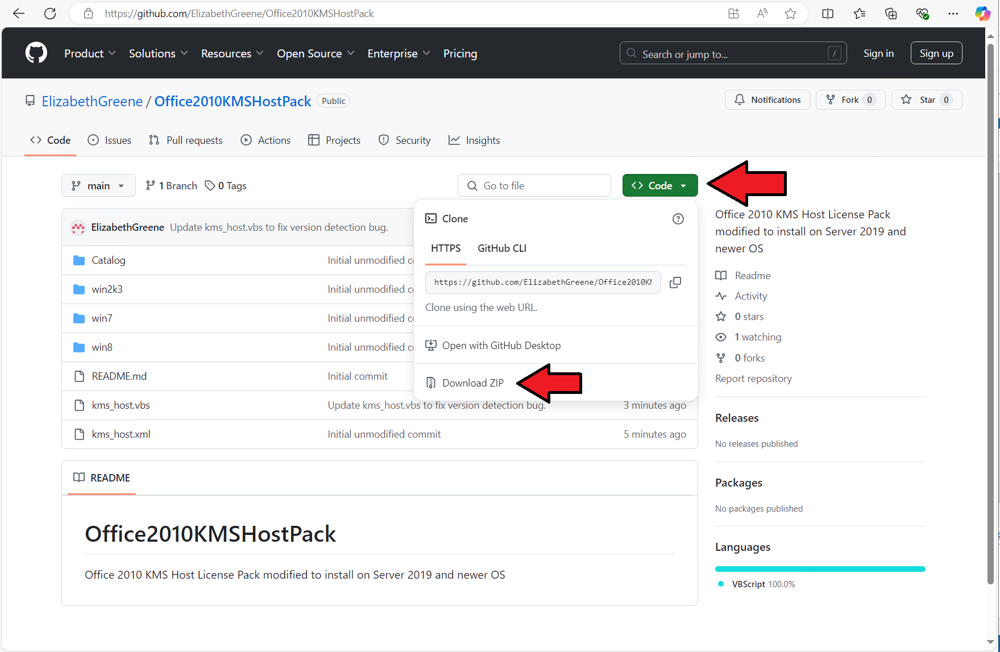

# Office2010KMSHostPack

Office 2010 KMS Host License Pack modified to install on Server 2019 and newer OS

**Disclaimer: This solution is not endorsed or supported by Microsoft. Use it entirely at your own risk.**

## What is this?

The Office 2010 KMS Host License Pack available from Microsoft will not install on Windows Server 2019 and newer OS due to this tiny one-line bug in the included kms_host.vbs script.

I've fixed that, and am making it available for download here. It works for me, and it should work for you. That said, this modification is not supported by myself or Microsoft. Use it at your own risk.

## How do I install it?

From the github repository, click the green code button and then click "Download Zip".

Extract the Zip file into a folder, right-click "RunThisAsAdministrator.bat", and select "Run As Administrator".

## Contacts

Please report any comments or issues via the issues tab above or ping the author on X at [@GreeneElizabeth](https://x.com/GreeneElizabeth).
